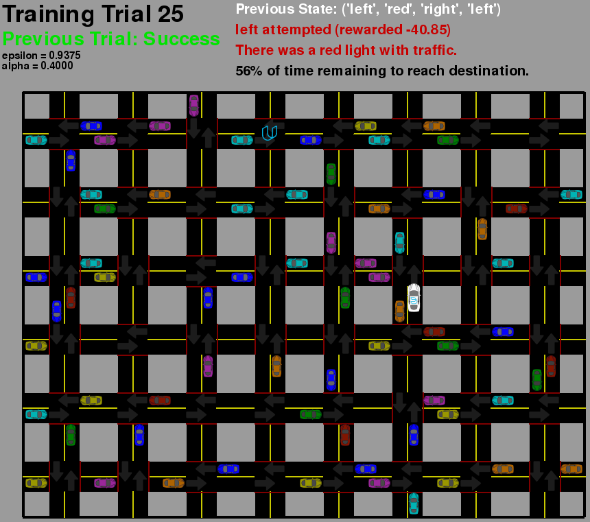
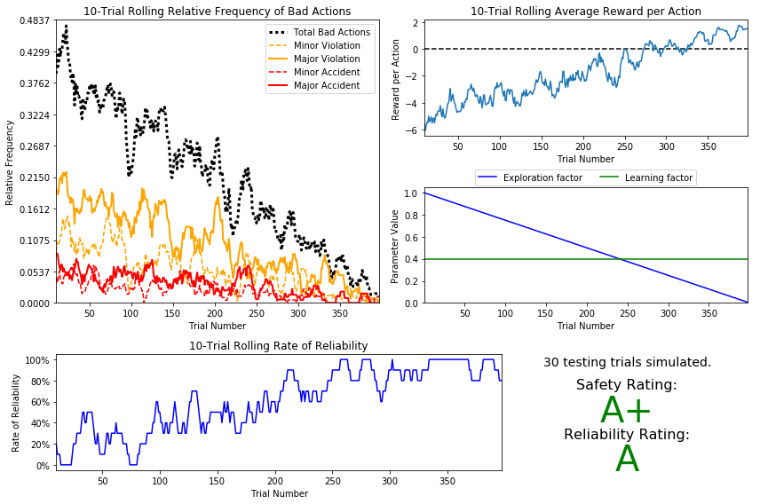

# Udacity Machine Learning Engineer Nanodegree
# Reinforcement Learning
## Project: Train a Smartcab How to Drive




### description

in a simplified world, a Smartcab will have to learn from scratch how to drive by its own through intersection with hundreds of other vehicles on the roads, without causing violations or accidents, and reach its destination before running out of time! Yeah, all of that ;) 

Smartcab is the 4th project of the Udacity Machine Learning Engineering Nano-degree and speaks about **reinforcement learning techniques**, **Q learning**, **iterative value update** and **exploration vs. exploitation dilemma**.

The results and discussions are presented in the **[smartcab.ipynb notebook](smartcab.ipynb)**. 

### Install

This project requires **Python 2.7** with the following librairies:

- [Python 2.7](https://www.python.org/download/releases/2.7/)
- [NumPy](http://www.numpy.org/)
- [pandas](http://pandas.pydata.org/)
- [matplotlib](http://matplotlib.org/)
- [PyGame](http://pygame.org/)

### Run

In a terminal or command window, run one of the following commands:

```python smartcab/agent.py```  
```python -m smartcab.agent```

This will run the `agent.py` file and execute the agent code.

**important:** in the `run()` method of the `LearningAgent` class (in the `agent.py` file): 

- 3 learning configurations are available:
	- `conf = 'basic'`				: the Smartcab simply performs random actions and doesn't learn
	- `conf = 'Q_learning'`			: the agent performs a simplified Q-learning 
	- `conf = 'optimized_Q_learning'` : the agent performs an optimized Q-learning
- The GUI display can be turned on and off with the `display` (`=True` or `=False`) flag of the `Simulator`
